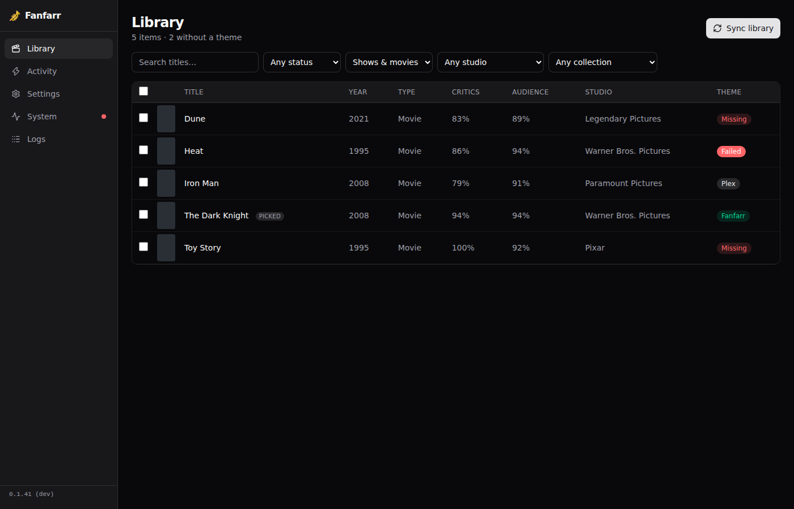
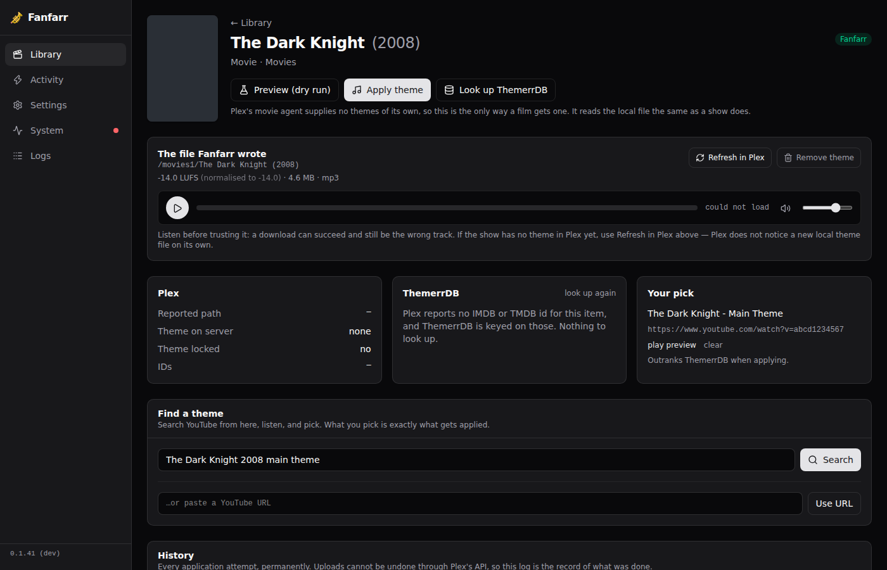
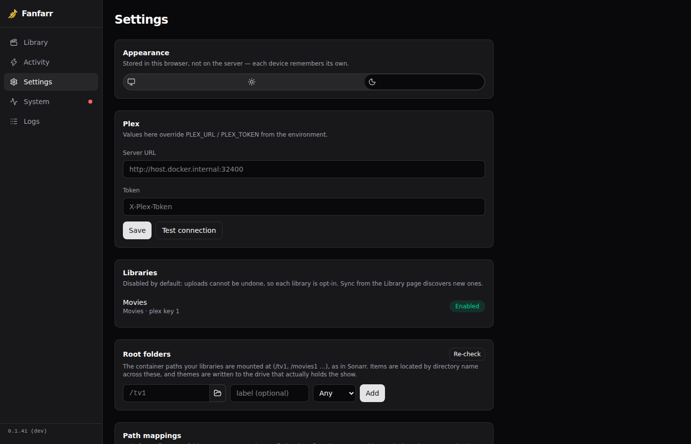

# Fanfarr 🎺

Theme music management for Plex, in the *arr family. Fanfarr finds the shows
and movies in your library that have no theme music, resolves themes from
[ThemerrDB](https://github.com/LizardByte/ThemerrDB), and applies them — with
an *arr-style dashboard, a real job queue, and an append-only record of
everything it does to your server.

Successor in spirit to LizardByte's Themerr-plex, which ended with Plex's
plugin framework. Fanfarr is a standalone service: no plugin, no Plex Pass
required.



<details>
<summary>More screenshots</summary>

**Item page** — status, ThemerrDB result, YouTube search, and the append-only
history for this title.



**Settings** — Plex connection, libraries, root folders, path mappings, theme
downloads, and appearance, all in one place.



</details>

## Features

- **Library dashboard** — every show and movie with its poster, theme status,
  critic/audience scores (normalised to one scale, whichever service Plex
  used), and studio. Filter by status, type, studio, or collection; sort any
  column by clicking it; search. Served from a local mirror, so it stays fast
  at thousands of items, and remembers your filters when you open an item and
  come back.
- **Knows a stock theme from a chosen one** — Plex marks its own agent's
  themes in the `ratingKey`, and Fanfarr reads it. A show that "has a theme"
  because Plex shipped one is listed as such, so it can be found and replaced.
- **Movies and shows both** — Plex's movie agent supplies no themes at all, so
  a local `theme.mp3` is the only way a film gets one, verified end to end.
- **Find a theme without leaving the page** — search YouTube from the item
  page, play the result inline, and pick it. What you pick is exactly what
  gets applied, and it outranks ThemerrDB from then on. Or paste a URL.
- **ThemerrDB** — the community theme database is looked up automatically as
  the default source; misses are cached so nothing is re-requested.
- **Dry run first, by default** — a preview resolves the source and the
  destination and checks the folder is writable, then stops. Run it on the
  whole library before writing a single file.
- **Bulk actions** — tick rows, or select everything matching a filter, and
  preview, look up, or apply in one go. Each queues one job per item, capped
  at 2 concurrent downloads so a thousand-item run does not hammer YouTube,
  and stoppable mid-run from Activity without losing whatever already applied.
- **Local `theme.mp3`, never an upload** — themes are written beside the
  media, where deleting the file undoes them. Plex's upload API cannot be
  undone, so it is not used.
- **Renamed folders don't fork a row** — a Plex rename issues a new item id;
  Fanfarr recognises it by IMDb/TMDB/TVDB id and keeps the same row, theme and
  history rather than starting over. An item Plex has genuinely dropped is
  removed on the next sync.
- **Root folders, like Sonarr** — mount each library location wherever you
  like (`/tv1`, `/tv2`, …), browse to it from Settings, and items are located
  by directory name across the roots so a theme lands on the drive that holds
  the show.
- **Loudness normalisation** — every applied theme is brought to a consistent
  level (-14 LUFS by default, adjustable in Settings), so one show is not
  blasting while the next is inaudible.
- **System page** — Sonarr-style health checks: Plex reachable, yt-dlp
  present, root folders writable, Plex paths resolving on this side of the
  mount, ThemerrDB up, database healthy. A dot on the sidebar when something
  needs attention.
- **A real log console** — a full-page, colour-coded, filterable log view for
  when something needs debugging, separate from the System page's health
  checks.
- **Append-only application log** — every attempt Fanfarr makes is recorded
  permanently: what, when, from where, and how it went. Dry runs included,
  but never counted.
- **Activity view** — live job queue with an ETA, per-job errors and retry, a
  "Stop bulk theme work" button that cancels every queued and running job in
  one click, plus recent theme failures with their actual error message.
- **Login from the environment** — set `AUTH_USERNAME` and `AUTH_PASSWORD` and
  that is the account, with an optional "remember me" and a Sonarr/Radarr-style
  bypass for local addresses. Leave both unset and the dashboard is open, same
  as the *arrs.
- **Safe by default** — libraries are opt-in, dry-run is the default, and
  posters are cached server-side so your Plex token never reaches a browser.
- **One container, one volume** — SQLite for everything, secrets generated on
  first boot, `PUID`/`PGID` respected, port 7373.

## Tech stack

Elixir / [Phoenix LiveView](https://www.phoenixframework.org/) for the whole
UI — no separate frontend build, no API to keep in sync. [Ash
Framework](https://ash-hq.org/) on SQLite for the data layer, [Oban](https://oban.pro/)
for background jobs (sync, lookups, downloads, applies), `yt-dlp` + `ffmpeg`
for search/download/loudness. One Elixir release, one SQLite file.

## Running it

```yaml
services:
  fanfarr:
    image: ghcr.io/dyonng/fanfarr:latest
    container_name: fanfarr
    environment:
      - PUID=1000
      - PGID=1000
      - TZ=America/Toronto
    volumes:
      - ./appdata:/config
      # One mount per library location, exactly as Sonarr does it. Register
      # these paths as Root Folders in Settings.
      - /path/to/tv-drive-1:/tv1
      - /path/to/movie-drive-1:/movies1
    ports:
      - 7373:7373/tcp
    restart: unless-stopped
```

Open `http://<host>:7373`, create the operator account, set the Plex URL and
token under Settings, enable the libraries you want managed, and Sync.

See `docs/deployment.md` for path mapping, mergerfs specifics (`:rslave`,
create policies, `EXDEV`), reverse proxies, and why yt-dlp should not go
through your VPN.

## Authentication

```yaml
environment:
  - AUTH_USERNAME=admin
  - AUTH_PASSWORD=something-long-and-random
```

Both set: a login is required, reconciled to match on every start — change
the password by editing compose and restarting, which is also how you recover
a forgotten one. Both unset: authentication is off entirely, the same default
Sonarr and Radarr ship with — reasonable on a trusted LAN, unwise if the port
is exposed, and warned about in the logs on every boot.

"Remember me" keeps a browser signed in for 30 days. Settings also has
"Disable authentication for local addresses" — checked against the actual TCP
connection, not a header, so it cannot be spoofed from outside.

## Development

Elixir 1.19 / OTP 27 (pinned in `.tool-versions`), Phoenix LiveView, Ash on
SQLite, Oban for jobs. `mix setup`, `mix phx.server`, `mix precommit` before
pushing. `AGENTS.md` carries the decision record and is the first thing to
read before changing anything architectural.

## Roadmap

See [`ROADMAP.md`](ROADMAP.md) for what's built, what's next, and known gaps.

## License

TBD.
